# Wadi Ghadir gravity survey, Eastern Desert, Egypt (16–24 January 2026)

## Processing, quality control and provisional base-relative reductions of the CG-6 data

**Prepared by:** Dr. Mohamed Sobh, LIAG
**Date:** 2 October 2026
**Processing code:** `scripts/run_processing.py` (this repository); all numbers below are reproduced by that script from the files in `data/raw/`.

---

## 1  Executive finding

**Ready for use**

* Gravity differences relative to field base 100 (Δg₁₀₀) for **985 field occupations**. Of these, 531 come from CG-6 #0640 and 454 from CG-6 #0313. Each has row-level QC, a station-100 drift model, a coordinate-based GNSS match and a stated uncertainty. The median 1σ is 0.008 mGal for #0640 and 0.054 mGal for #0313.
* An audit trail covering all 1 519 instrument rows, 1 116 occupations, 33 hotel–base ties, the base-100 control series and the inter-instrument comparison.

**Provisional only**

* Base-relative free-air (ΔFA) and simple Bouguer (ΔSB) quantities, with a density sweep from 2.0 to 3.0 g/cm³. They are provisional for four reasons:
  * the vertical datum, geoid and antenna set-up of the GNSS heights are undocumented;
  * the #0313 values depend on an inter-instrument scale factor estimated from the field data;
  * no terrain correction has been applied;
  * the day-7 (22 Jan) GNSS heights carry a +2.5 to +3.2 m offset, which I have adjusted.

**Not possible with the supplied data**

* Absolute observed gravity. No absolute gravity value is available for base 100 or for the hotel station 0.
* Absolute free-air, Bouguer or complete Bouguer anomalies.
* A terrain correction. No DEM was supplied.
* A measured Bouguer density. The Nettleton profiles do not agree on one value (§4.3).

**Problems found and corrected in processing**

1. **#0313 tide correction.** The on-board tide was computed for the factory-default user position, 43.79 °N, 79.50 °W (Toronto). The error is up to 0.21 mGal (rms 0.090 mGal). I removed it and recomputed the tide at the station positions.
2. **#0313 frozen sensor output.** 27 readings returned RawGrav ≈ 8008.33 mGal whatever the station was. Two further readings are gross outliers, up to 5 700 mGal off. All 29 are rejected. This left base 100 without a closing value on 18 Jan and without an opening value on 20 Jan.
3. **#0313 scale.** #0313 reads a 1.19 % smaller gravity difference than #0640. The scale factor k = 1.01189 ± 0.00033 was estimated from 33 hotel–base ties and confirmed by co-located stations.
4. **#0313 drift and tare.** A +0.56 mGal tare occurred on 16 Jan at base 100, and about −0.4 mGal/day of drift remains that the on-board correction does not remove. The base-100 drift model absorbs both.
5. **Station-number collisions.** Point IDs are not global:
   * #0640 has a field station "100" (Line 1, 17 Jan) that is not base 100.
   * #0313 restarts station numbers on every line.
   * The GNSS files use bare numbers for #0313 points on 17–18 Jan, and two IDs were converted to dates by Excel.

   All GNSS links are therefore made by date and coordinates.
6. **GNSS day-7 height offset.** Both base marks are 2.51 m and 3.16 m too high on 22 Jan. Day-7 heights were reduced by 2.83 ± 0.32 m.

**Not supplied:** no separate "Interacts" export is among the attachments. All 1 519 gravity rows come from two CG-6 serial numbers, and no other gravity data are inferred.

---

## 2  Inventory and provenance

### 2.1 Files

| File | Bytes | Content |
|---|---:|---|
| `CG-6_0640_W_GHADIR_New_gravimeter.dat` | 138 508 | CG-6 S/N 000000024110640, survey "W_GHADIR", 795 rows |
| `CG-6_0313_W_GHADER_old_gravimeter.dat` | 129 588 | CG-6 S/N 000000021010313, survey "W_GHADER", 724 rows |
| `GPS_All_Days.xlsx` | 59 581 | 948 GNSS points (Sheet1; Sheet2/3 empty) |
| `results.zip` | 186 531 | `day1…day9.xlsx` (948 points in total) and `day1…day9.kml` |
| `Astra_processing_prompt.md` | 7 738 | processing brief |

SHA-256 checksums are in `outputs/tables/01_file_inventory.csv`, and the zip members are listed in `01b_results_zip_members.csv`.

### 2.2 Instrument metadata (`02_instrument_metadata.csv`)

| | CG-6 #0640 ("new") | CG-6 #0313 ("old") |
|---|---|---|
| Firmware | CG6_2_20240409 | CG6_2_20240409 |
| Operator field | NRIAG | NRIAG |
| Gcal1 [mGal] | 8323.669 | 7869.544 |
| Gref [mGal] | 0.0 | 8000.0 |
| Temperature coefficient [mGal/mK] | −0.126 | −0.133 |
| On-board drift rate [mGal/day], zero time | 0.0 (2024-07-17) | 0.3975 (2020-12-16) |
| User position for tide (Lat/Lon/Elev) | 25.327812 / 34.625248 / 149.4 | **43.79 / −79.50354 / 209.07** |
| First / last reading | 2026-01-16 03:52:49 / 2026-01-24 17:41:21 | 2026-01-16 03:54:27 / 2026-01-24 17:58:32 |
| Rows / survey days / lines | 795 / 9 / 0, 1 | 724 / 9 / 0, 2–15 |
| Reading duration, InstrHeight | 60 s, 0.000 m (all rows) | 60 s, 0.000 m (all rows) |
| Correction flags `[drift-temp-na-tide-tilt]` | 11011 (all rows) | 11011 (all rows) |

Both exports contain the same 24 columns: Station, Date, Time, CorrGrav, Line, StdDev, StdErr, RawGrav, X, Y, SensorTemp, TideCorr, TiltCorr, TempCorr, DriftCorr, MeasurDur, InstrHeight, LatUser, LonUser, ElevUser, LatGPS, LonGPS, ElevGPS and Corrections.

### 2.3 Time base

The exports carry no time-zone field. To identify it, I recomputed the on-board tide with the Longman (1959) formula (`wghadir/tide.py`) at the user-entered position:

* With the time stamps taken as **UTC**, the recomputation matches the TideCorr column of both meters to 0.19–0.21 µGal rms (max 0.43 µGal).
* With the time shifted by ±2 h or ±3 h, the misfit is 49–74 µGal rms.

The instrument clocks therefore ran on UTC; local time (EET) is UTC+2. In local time the field days ran from 05:48 to 20:08.

### 2.4 On-board corrections and their verification

For every row,

  CorrGrav = RawGrav + TideCorr + TiltCorr + TempCorr + DriftCorr

This closes to 6.5–6.7 × 10⁻⁵ mGal rms (max 0.0002 mGal, i.e. export rounding) for both meters (`03_corrgrav_verification.csv`). Tide, tilt, temperature and drift are therefore all already included in CorrGrav. The terms are plotted in Fig. 3.

| Term | #0640 | #0313 |
|---|---|---|
| Tide | Longman at user position (≈60 km from survey) | Longman at **Toronto** |
| Tilt | median 0.001 mGal | median 0.0007 mGal |
| Temperature | ≈ +0.49 mGal (SensorTemp 3.83–4.01) | ≈ +0.27 mGal (SensorTemp 1.94–2.21) |
| Drift | 0 (rate 0) | −737.9 to −741.3 mGal (rate 0.3975 mGal/day since 2020-12-16) |

No correction is applied twice anywhere in the chain:

* **Tide:** the on-board TideCorr is subtracted and the recomputed tide is added:

  g_tidefix = CorrGrav − TideCorr + T_Longman(t_UTC, φ_GPS, λ_GPS)

  I did this for both meters so that the processing is uniform. For #0640 the change is ≤ 3.1 µGal (1.8 µGal rms). For #0313 it is up to 0.215 mGal (89.6 µGal rms) (`04_tide_check.csv`, Fig. 2).
* **Tilt, temperature and the on-board linear drift** stay as the instrument applied them.
* **Residual drift** is modelled separately from the base-100 occupations (§3.3). The instrument output (CorrGrav) is preserved unchanged in `05_rows_qc.csv`.

The tide model is Longman (1959) with a 1.16 amplitude factor, the same model the CG-6 uses. It contains no ocean loading. Loading at < 20 km from the Red Sea coast can reach a few µGal; that is below the #0313 noise level and is neglected here.

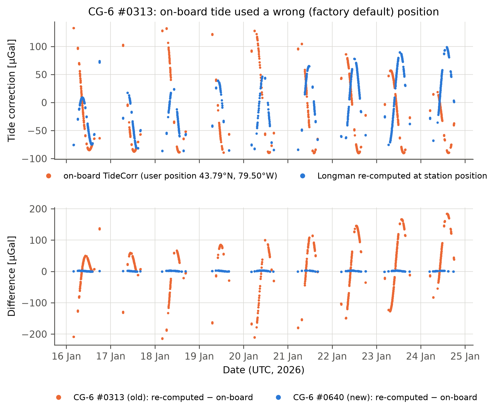
*Fig. 2 – Top: #0313 on-board TideCorr (Toronto position) and the Longman tide at the station positions. Bottom: recomputed minus on-board tide for both meters. The #0640 difference stays within ±3 µGal.*

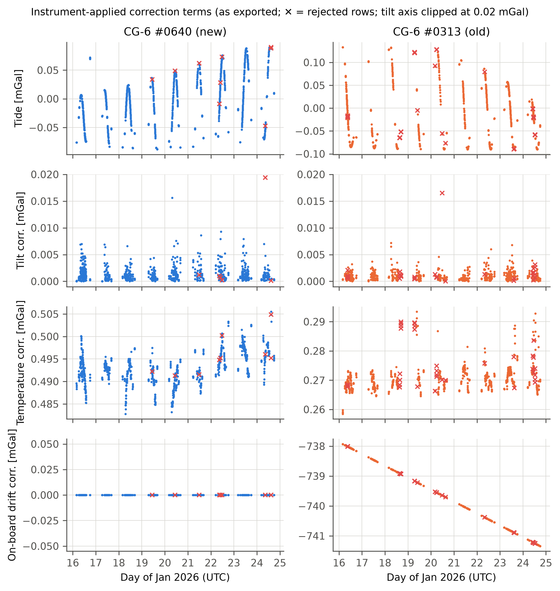
*Fig. 3 – Correction terms as exported by the instruments; ✕ marks rejected rows. The tilt axis is clipped at 0.02 mGal, and three overflow/blunder rows lie above it.*

---

## 3  Processing chain and QC results (acquisition order)

### 3.1 Row-level QC (`05_rows_qc.csv`, `06_qc_*.csv`)

Every row is kept, with an `accepted` flag, `reject_reasons` and `warnings`.

| Rule | Threshold | Basis |
|---|---|---|
| OVERFLOW_FIELD | any field printed as `******` | instrument overflow |
| FROZEN_SENSOR_OUTPUT | #0313 RawGrav in 8007.5–8009.0 mGal | identical RawGrav at stations 0 and 100, which differ by 65 mGal |
| GROSS_RANGE | \|g − instrument median\| > 500 mGal | the true survey range is < 170 mGal |
| STDDEV reject / warn | > 0.080 / > 0.050 mGal | ≈ 99.5th / 95th percentile |
| TILT reject / warn | max(\|X\|,\|Y\|) > 30 / > 20 arcsec | levelling not trusted |
| REPEAT_OUTLIER | > 0.050 mGal from the median of the other readings (n ≥ 3) | base occupations |
| TWO_READINGS_DIFFER (warn) | two readings differ > 0.050 mGal | — |

| Outcome | #0640 | #0313 |
|---|---:|---:|
| Rows | 795 | 724 |
| Accepted | 786 | 686 |
| Rejected: frozen sensor | – | 27 |
| Rejected: gross range (with overflow and/or tilt) | 2 | 2 |
| Rejected: overflow only | 1 | – |
| Rejected: StdDev > 0.08 | 4 | – |
| Rejected: tilt > 30″ only | 2 | 1 |
| Rejected: repeat outlier | – | 8 |
| Warnings: StdDev > 0.05 / tilt > 20″ / two readings differ | 33 / 16 / 0 | 33 / 5 / 10 |

**What alternative thresholds would cost** (`06_qc_threshold_sensitivity.csv`): tightening the StdDev limit to 0.05 mGal would remove 37 + 33 rows and 47 occupations; tightening the tilt limit to 15″ would remove 95 rows and 51 occupations. Most field stations have a single 60-s reading (491 of 559 on #0640, 400 of 466 on #0313), so each rejected reading usually removes a station.

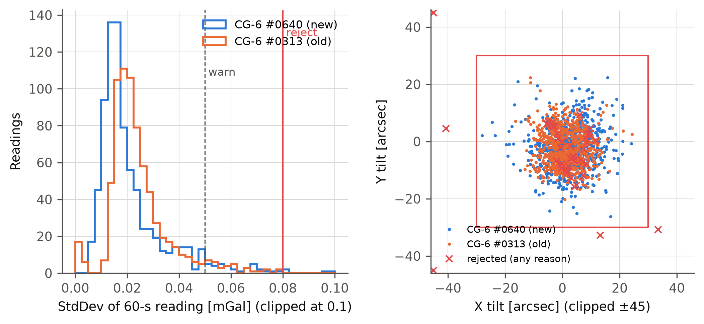
*Fig. 5 – StdDev distribution with the warning and rejection limits (left); X/Y tilt with the ±30″ rejection box and all rejected readings (right).*

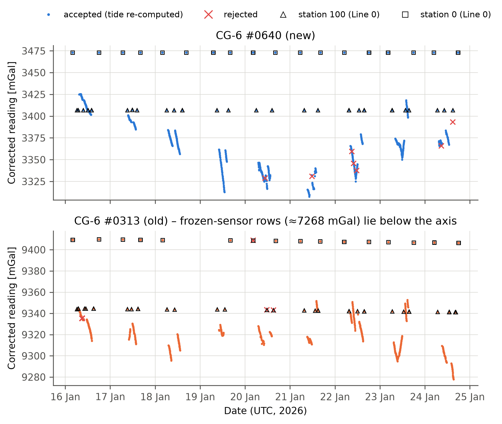
*Fig. 4 – Corrected readings (tide recomputed) through time. Triangles are station 100 and squares are station 0, both on Line 0; ✕ marks rejected readings. The #0313 frozen-sensor readings (≈ 7 268 mGal) are off-scale.*

### 3.2 Occupations and station identity (`15_occupations.csv`)

An occupation is a run of consecutive readings with the same instrument, date, Line and Station. A gap of more than 15 min starts a new occupation. This gives **1 116 occupations**:

* #0640: 559 field, 26 station-100 and 18 station-0 occupations.
* #0313: 466 field, 29 station-100 and 18 station-0 occupations.

**Station roles.** Base 100 is Station 100 **on Line 0**, checked to lie within 50 m of the base-100 GNSS mark. The station-0 hotel mark is identified the same way. This distinguishes base 100 from #0640 field station 100 (Line 1, 17 Jan 12:54), which reads 17 mGal lower. Every #0313 line restarts at station 1, so a station number never identifies a point on its own.

**Mislabelled reading.** On 16 Jan, #0313 Line 3 has a reading labelled "3" between stations 9 and 10. Its CG-6 GPS position lies 1.5 m from GNSS point 3-10.

### 3.3 GNSS: parsing, day mapping, datum checks and matching

**Parsing.** I parsed the DMS text into decimal degrees.

* The 9 daily workbooks (948 points) are identical row by row to `GPS_All_Days.xlsx`; the master is their concatenation and carries no date column.
* Height errors are reported only for day 1: 119 points, 0.04–0.53 m, median 0.23 m.
* The KML files repeat the workbook coordinates within 0.2 mm. They also contain **71 station points not in the workbooks**, which I used as a secondary, flagged source. Of these, 47 were matched to #0640 occupations and 30 to #0313 occupations.
* The KML also holds the local east/north coordinates of a processing reference named **MRSA**, placed 12 m above Base0 at the hotel.

**Day mapping.** Each date was matched by coordinates against each daily file (`08_gnss_day_mapping.csv`), which gives the unambiguous diagonal day1 = 16 Jan … day9 = 24 Jan. In the day-4 workbook, two IDs had been converted by Excel to dates (2026-01-04 and 2026-02-04). The KML names them 4-1 and 4-2, and they match #0313 L6-1 and L6-2 by coordinates.

**Datum checks** (`09_gnss_*`, Fig. 9).

* **Base0 (hotel):** repeats to 0.044 m rms across days.
* **Base100:** repeats to 0.126 m rms (range −0.27 to +0.12 m), excluding day 7.
* **Day 7 (22 Jan):** Base0 is +2.51 m and Base100 +3.16 m above their multi-day medians, with horizontal offsets of 0.6 and 2.2 m. Both marks agree in sign and exceed 0.5 m, so I reduced all day-7 heights by their mean, **2.83 m**. Its uncertainty is ±0.32 m (half the difference between the two marks), added in quadrature to the height uncertainty.

  A gravity check is consistent with this adjustment but cannot prove it (`20_day_boundary_height_check.csv`). Along the two #0313 lines that cross the day-6/7 and day-7/8 boundaries, the simple-Bouguer step at the boundary is −0.14 and −0.01 mGal with the adjustment. Without it the steps would be +0.42 and −0.56 mGal. The neighbouring steps along those lines are 0.11–0.19 mGal (median) and up to 0.5 mGal (p90).
* **Day 1:** the MRSA reference coordinate differed from days 4–9 by 2.47 m horizontally and +0.118 m vertically. Both day-1 base marks move by this amount (2.45–2.47 m; +0.10/+0.12 m). I did not adjust it: it is below the threshold, and its effect on normal gravity is < 0.002 mGal.

**Matching** (`15_occupations.csv`, columns `match_*`, `gnss_*`).

* The median CG-6 internal GPS position of each occupation is compared with the GNSS points of the same day.
* A match is accepted at ≤ 30 m.
* A match is "ambiguous" if a second point at a distinct location (> 5 m from the first) lies within 10 m of the first separation. Points within 5 m of each other count as one location; the label that agrees with the instrument record is preferred, which does not change the coordinates.
* An ambiguous case is resolved by the point label only when exactly one candidate agrees with the instrument's line and station. This applied to 10 occupations, where the #0640 traverse and #0313 Line 5 or Lines 12–14 run 8–15 m apart (`MATCHED_ID_TIEBREAK`).
* No match is made from a point ID alone.

| | #0640 | #0313 |
|---|---:|---:|
| Matched (distance) | 577 | 505 |
| Matched (ID tie-break) | 5 | 5 |
| No GNSS point within 30 m | 21 | 3 |
| Median / max separation [m] | 5.7 / 21.0 | 6.0 / 24.5 |

The 21 unmatched #0640 occupations are stations 106, 322–334, 351, 352, 382, 429 and 550, which have no GNSS point in either the workbook or the KML. Station 558 lies 38 m from the nearest point. A second "555" reading on 24 Jan was taken 450 m from station 555 near base 100. The 3 unmatched #0313 occupations are 18 Jan L5-19 (30.8 m) and two 22 Jan "L11-1" occupations whose CG-6 GPS positions lie 0.2–0.6 km from L11-1. All of them are kept in the tables and excluded from the products.

**Height datum.** The GNSS heights were processed relative to MRSA, whose assumed height is 48.868 m (48.986 m on day 1). The data do not document:

* whether the heights are ellipsoidal or orthometric;
* the reference frame and epoch;
* the geoid model;
* the antenna or pole heights.

The CG-6 internal GPS elevations are on average 12.1 m lower than the GNSS heights (sd 10.8 m). That is compatible with ellipsoidal GNSS heights and receiver heights above mean sea level (geoid undulation ≈ +10–12 m), but the scatter of the internal GPS is too large for this to count as evidence. **Height-dependent products are therefore provisional.**

All reductions use heights relative to base 100, so a constant datum offset cancels. The variation of the geoid across the 27 × 17 km area does not cancel: it enters the free-air term at 0.31 mGal per metre. InstrHeight is 0 in all rows (sensor height above the mark not entered). A constant sensor-to-mark offset cancels in base-relative values only if the set-up was the same everywhere.

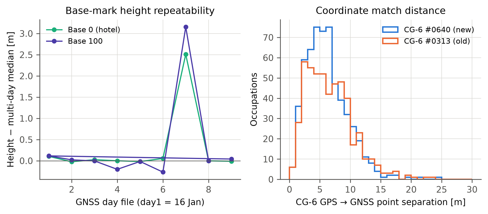
*Fig. 9 – Daily height of the two base marks relative to their multi-day median (left); separation between the CG-6 GPS position and the matched GNSS point (right).*

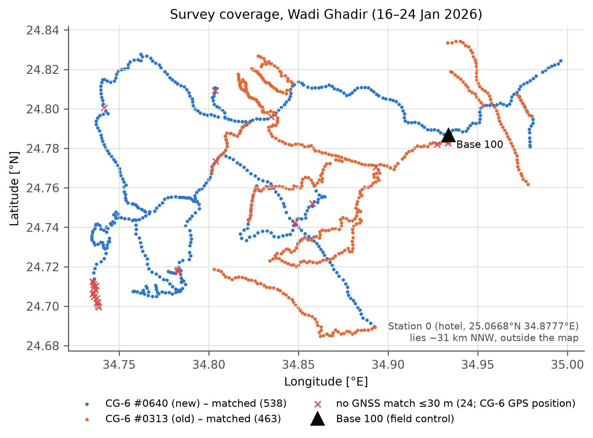
*Fig. 1 – Field occupations matched to GNSS points, by instrument. ✕ marks occupations with no GNSS point within 30 m. The hotel station 0 lies ~31 km NNW of base 100.*

### 3.4 Base control and drift model (`10`–`13_*.csv`, Figs. 6–7)

**Control values.** The drift model is built separately for each instrument and day:

* A valid station-100 occupation (Line 0, ≥ 1 accepted reading, within 50 m of the mark) gives g₁₀₀ directly.
* A valid station-0 occupation becomes a supplementary control value, g₁₀₀ = g₀ + T. Here T is the instrument's median 0→100 tie, and its standard deviation is added to the uncertainty. This value affects field data only where a station-100 control is missing:
  * 20 Jan, #0313, Line 9: interpolated between the hotel at 04:16 and base 100 at 11:39 (25 occupations).

**Drift model.** Field occupations are referenced to

  Δg₁₀₀ = g_occ − g₁₀₀(t)

where g₁₀₀(t) is a piecewise-linear interpolation between successive control values of the same day. Outside the controlled interval the value is extrapolated with the rate of the nearest segment. Its uncertainty is

  σ² = σ_occ² + interpolated σ_ctrl² + σ_model² (+ (σ_rate Δt)² when extrapolated)

σ_model is the rms leave-one-out misclosure of interior base-100 occupations:

* #0640: **7.8 µGal** (8 interior occupations).
* #0313: **53 µGal** (7 interior occupations; the 0.47 mGal tare misclosure is excluded and reported separately).

**Daily performance** (Fig. 6, `13_daily_closures.csv`).

| | #0640 | #0313 |
|---|---|---|
| Hotel 0→0 daily closure | −12 to +8 µGal | −405 to +458 µGal |
| Base-100 range within a day | 1–28 µGal | 52–558 µGal |
| Change in the first base-100 value per day (17–24 Jan) | −0.003 mGal/day | −0.40 mGal/day (on top of the on-board 0.3975 mGal/day) |
| Tares | none | +0.558 mGal between 06:11 and 06:55 UTC on 16 Jan, while at base 100 |

The 16 Jan tare falls between two base-100 occupations with no field station between them, so the drift model absorbs it.

**Problems with the #0313 base control.**

* **18 Jan:** the closing base-100 and station-0 readings are frozen. Line 5 stations 1–22 were first extrapolated by 1.5–6.3 h.
* **19 Jan:** the morning station-0 reading is frozen.
* **20 Jan:** the morning base-100 reading is frozen.
* **24 Jan:** one base-100 occupation is frozen.

The 18 Jan Line 5 segment was re-tied to #0640 using 5 co-located points (§3.5).

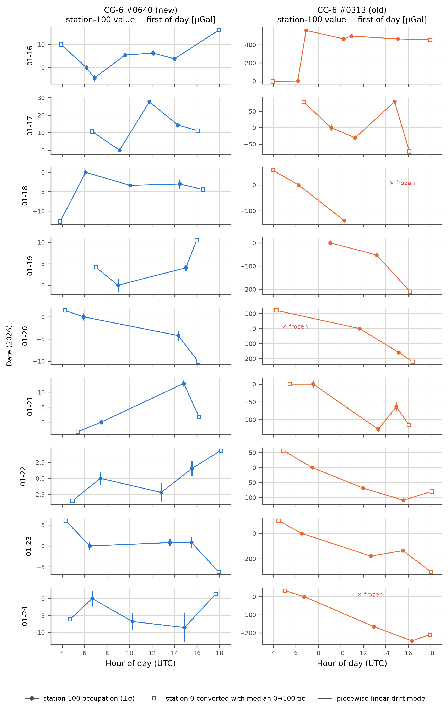
*Fig. 6 – Base-100 control values per day, relative to the first of the day (µGal; note the 10–20× larger scale for #0313). Squares are station-0 occupations converted with the median tie; ✕ marks frozen occupations.*

### 3.5 Inter-instrument reconciliation (`11_*.csv`, `14_*.csv`, Figs. 7–8)

The two meters are compared only through physical co-location. Station numbers are never used for this.

**(a) Hotel 0 → base 100 tie.** Each day has a morning and an evening leg, raw, ≤ 4 h:

* #0640: −66.0742 ± 0.0077 mGal (sd, n = 18).
* #0313: −65.3101 ± 0.0868 mGal (sd, n = 15).

The ratio is **k_tie = 1.01170 ± 0.00035**. The difference (0.76 mGal over a 66 mGal tie) is far larger than either meter's repeatability and is the same in the morning and evening legs. Drift therefore cannot explain it; it is a scale (calibration) difference.

**(b) Co-located field stations.** These are pairs ≤ 10 m apart with |Δh| ≤ 0.5 m and interpolated drift on both meters. Three pairs, spanning 42 mGal, give **k = 1.0136 ± 0.0010** (through the origin, SE propagated from the station sigmas). This agrees with k_tie at 1.7σ.

**Applied scale.** The weighted combination **k = 1.01189 ± 0.00033** multiplies all #0313 Δg₁₀₀ values (`dg100_scaled_mgal`); the unscaled values are kept. #0640 is the reference because its repeatability is about ten times better. Which meter is correct in an absolute sense **cannot be decided** without a calibration line or absolute stations: if #0640 is itself off, every value inherits that error.

**Re-tie of the extrapolated segment.** Five co-located #0640/#0313 pairs on 18 Jan (Line 5 vs #0640 stations 153–158) show that the extrapolated #0313 values are offset by **−0.225 ± 0.022 mGal**. I applied this offset to the 21 extrapolated #0313 occupations of that day and flagged them `RETIED_COLOCATION`. One #0313 occupation (19 Jan, 2.0 h) is still extrapolated and flagged.

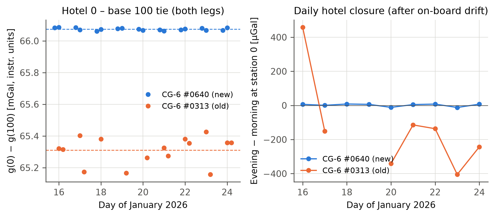
*Fig. 7 – Hotel 0 to base 100 ties (left) and the daily station-0 closure (right) for both meters.*

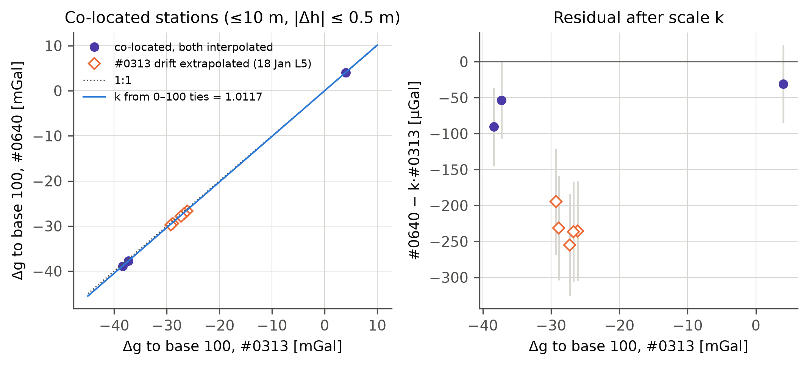
*Fig. 8 – Co-located stations: #0640 against #0313 Δg₁₀₀ (left) and the residual after k_tie (right). Diamonds are the 18 Jan Line 5 points before the re-tie.*

---

## 4  Reductions and density

### 4.1 Base-relative reductions (`16_field_stations_relative.csv`)

All terms refer to base 100 (φ₁₀₀ = 24.786749 °N, h₁₀₀ = 111.77 m). h₁₀₀ is the median of the nine daily solutions after the day-7 adjustment (sd 0.17 m).

| Quantity | Equation | Sign convention |
|---|---|---|
| Observed difference | Δg₁₀₀ (scaled for #0313) | measured |
| Normal gravity | γ(φ) − γ(φ₁₀₀), Somigliana closed form, WGS84 | subtracted |
| Free-air | FA(h) − FA(h₁₀₀), FA(h) = (0.3087691 − 0.0004398 sin²φ) h − 7.2125×10⁻⁸ h² | added |
| Simple Bouguer slab | 0.04193 ρ (h − h₁₀₀) mGal, ρ in g/cm³, h in m | subtracted |

The two products are

  ΔFA = Δg₁₀₀ − [γ(φ) − γ(φ₁₀₀)] + [FA(h) − FA(h₁₀₀)]

  ΔSB(ρ) = ΔFA − 0.04193 ρ (h − h₁₀₀)

ΔSB is tabulated for ρ = 2.00, 2.20, 2.40, 2.50, 2.60, 2.67, 2.70, 2.80 and 3.00 g/cm³.

These are **differences relative to base 100**. They are not absolute free-air or Bouguer anomalies: adding the (unknown) anomaly of base 100 would convert them. If the GNSS heights are ellipsoidal, ΔFA is strictly a gravity-disturbance difference.

**Ranges for the 985 product stations**

| Quantity | Range |
|---|---|
| Height | 13.7–502.1 m |
| Δh | −98 to +390 m |
| Δg₁₀₀ | −94.4 to +18.3 mGal |
| ΔFA | −14.9 to +37.0 mGal |
| ΔSB(2.67) | −14.4 to +10.0 mGal |

**Uncertainty.** σ_h = 0.15 m nominal (the base-100 day-to-day scatter), plus 0.32 m in quadrature on day 7.

| Median 1σ | #0640 | #0313 |
|---|---:|---:|
| Δg₁₀₀ | 0.008 mGal | 0.054 mGal |
| ΔFA | 0.047 mGal | 0.071 mGal |

**Density sensitivity.** ΔSB changes by 0.04193·Δρ·Δh. At the highest station (Δh = 390 m) a 0.1 g/cm³ change in density moves ΔSB by 1.6 mGal.

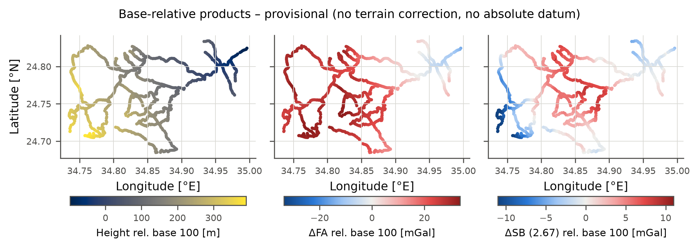
*Fig. 10 – Height, ΔFA and ΔSB(2.67) relative to base 100. Provisional: no terrain correction and no absolute datum.*

### 4.2 Terrain correction

No DEM was supplied, so **no terrain correction was applied**, and the products are labelled simple Bouguer and provisional. `scripts/terrain_correction.py` is ready for when a DEM is available:

* It builds a Harmonica prism layer from the DEM (top = DEM height, reference = 0 m, density ρ; negative heights get negative density).
* It computes g_topo at the station and at base 100, and returns ΔCB = ΔFA − [g_topo(station) − g_topo(base 100)] and the classical terrain correction TC.
* Its self-test reproduces the infinite-slab value to 0.1 % (33.553 against 33.586 mGal for a flat 300 m DEM).

The DEM must:

* use the same vertical datum as the station heights (or be converted with a documented geoid model);
* extend at least 22 km (preferably 167 km) beyond the survey;
* have ≤ 30 m resolution near the stations, with a resolved near-zone (< 50 m), because the stations lie in wadis;
* be validated against the GNSS heights at the stations.

### 4.3 Nettleton density test (`17`–`19_*.csv`, Figs. 11–12)

**Profiles.** I used the actual traverses:

* each #0313 line;
* the #0640 sequence, split where consecutive stations are more than 1 km apart.

Each profile is ordered by station number, and its chainage is the cumulative inter-station distance. Eligible profiles have ≥ 15 product stations and ≥ 40 m of relief, which gives 22 profiles, 2.7–30.4 km long with 52–338 m of relief. Stations with extrapolated drift are excluded.

**Method.** For ρ from 1.80 to 3.20 g/cm³ in steps of 0.01, a linear regional trend in chainage is removed from ΔSB(ρ) and from Δh, and their correlation is computed. The density of zero correlation equals the regression estimate from ΔFA = a + b·x + ρ·(0.04193 Δh), which also gives a standard error and a 2 000-sample moving-block bootstrap interval (block = 5 stations). As a second test, the same regression was run in non-overlapping 3 km windows (≥ 10 stations, ≥ 30 m relief).

**Results.**

* **Whole profiles:** the regression densities range from −13.0 to +12.0 g/cm³. Only 6 of the 22 profiles have a zero crossing inside 1.8–3.2 g/cm³:

  | Profile | ρ [g/cm³] |
  |---|---|
  | O-L3 | 2.94 ± 0.07 |
  | N-L1-433-501 | 2.88 ± 0.09 |
  | N-L1-301-335 | 3.01 ± 0.28 |
  | N-L1-541-557 | 2.93 ± 0.73 |
  | N-L1-1-148 | 3.03 ± 2.05 |
  | O-L9 | 3.15 ± 0.13 |

  Several profiles keep a correlation of ±0.5 to ±0.95 across the whole range. In those, the anomaly varies along the profile in ways a density adjustment cannot remove.
* **3 km windows:** 51 windows qualify, and 17 have SE < 1 g/cm³. Those 17 give a median of 3.15 g/cm³ (IQR 2.23–3.42) and a weighted mean of 3.05 g/cm³. Their χ² is 57.7 for 16 degrees of freedom, so the windows are **mutually inconsistent**.

**Why no single density is defensible.**

1. **The independent estimates disagree** well beyond their uncertainties (above).
2. **No terrain correction.** The traverses follow wadis, so the stations sit below the surrounding relief. The missing terrain correction is largest where a station is low relative to its surroundings. Without it, ΔSB is too low at valley stations and correlates positively with height, which pushes the Nettleton density upward. The many estimates near or above 3.0 g/cm³ match this bias. They are not evidence of rock density.
3. **Geology and regional field.** The long traverses (up to 30 km) cross changing basement geology and a regional gradient that a linear trend does not fully remove.

**Provisional working value:** **ρ = 2.67 g/cm³**, the conventional crustal density. It is not a measured value. Sensitivity products for 2.0–3.0 g/cm³ are in `16_field_stations_relative.csv`. The Nettleton test should be repeated after terrain correction, on short profiles across individual topographic features. Laboratory densities of outcrop samples from the main lithologies would be the more reliable constraint.

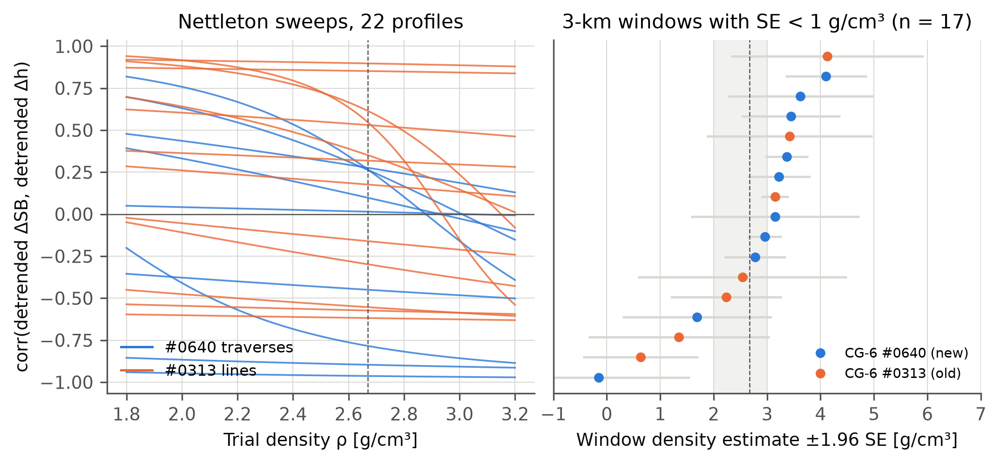
*Fig. 11 – Left: correlation between detrended ΔSB and detrended Δh against trial density for the 22 profiles. Right: 3 km window density estimates (±1.96 SE) with SE < 1 g/cm³. The grey band marks 2.0–3.0 g/cm³ and the dashed line 2.67.*

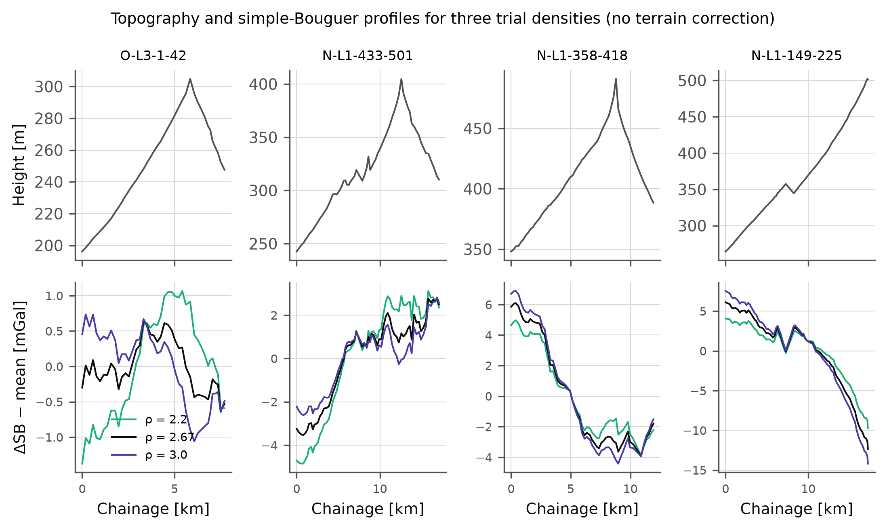
*Fig. 12 – Topography (top) and ΔSB minus its mean for ρ = 2.2, 2.67 and 3.0 g/cm³ (bottom), for the four profiles with the smallest regression standard error. No terrain correction is applied.*

---

## 5  Code, outputs and missing metadata

### 5.1 Code

```bash
python -m pip install -r requirements.txt
python scripts/run_processing.py --raw data/raw --out outputs
python -m pytest -q tests
python scripts/terrain_correction.py --selftest
```

The main script runs in about 15 s on a laptop. The tests check:

* DMS parsing;
* normal gravity at the equator and the pole;
* the slab constant;
* that the Longman module reproduces both on-board tide columns to < 1 µGal;
* the CorrGrav identity.

### 5.2 Machine-readable outputs (`outputs/tables/`)

| File | Content |
|---|---|
| 01, 01b | file inventory with SHA-256; zip members |
| 02 | instrument header metadata |
| 03 | CorrGrav = Raw + corrections verification |
| 04 | tide checks (position, time shifts) |
| 05_rows_qc | **all 1 519 rows**, original columns + recomputed tide, g_tidefix, accept/reject, reasons, occupation, GNSS match |
| 06 | QC thresholds and threshold sensitivity |
| 07 | all GNSS points (workbook, KML-only, reference), day, date |
| 08 | date ↔ GNSS day-file mapping evidence |
| 09 | base-mark heights per day; per-day datum adjustment |
| 10–13 | control points, hotel–base ties, leave-one-out misclosures, segment rates, daily closures |
| 14 | co-located instrument pairs; extrapolated-segment re-tie |
| 15_occupations | all 1 116 occupations: values, sigma, role, GNSS match (distance, second candidate, ID consistency, source), drift mode, Δg₁₀₀ |
| 16_field_stations_relative | field products: Δg₁₀₀ (raw and scaled), Δh, Δγ, FA term, ΔFA, ΔSB(ρ) sweep, sigmas, `product_ok` |
| 17–19 | profile stations and summary, Nettleton sweeps and results, window estimates |
| 20 | day-7 height adjustment check |
| `summary.json` | key statistics, scale estimates, base references |

### 5.3 Decisions and information needed for final complete Bouguer anomalies

1. **Absolute tie.** An absolute gravity value at base 100 or at the hotel station 0. Station 0 is the easier choice: tie it to the Egyptian National Gravity Standardization Network (ENGSN97) or an absolute station with a calibrated meter in a closed loop.
2. **Instrument scale.** A calibration-line run (or the tie in item 1 made with both meters) to establish which meter's scale is correct. The current result rests on #0640, and the 1.19 % difference for #0313 is derived from the field data alone.
3. **GNSS metadata.**
   * The MRSA reference coordinate: how it was obtained (PPP or CORS), the reference frame and epoch, and its ellipsoidal or orthometric height.
   * The processing software and solution types (fixed or float).
   * Antenna and pole heights per day.
   * Whether the exported heights are ellipsoidal or orthometric, and with which geoid model (e.g. EGM2008 or a local Egyptian geoid).
   * An explanation of the **day-7 offset** (+2.5 to +3.2 m) and the day-1 MRSA coordinate change.
   * GNSS coordinates for the 20 #0640 stations without a GNSS point (106, 322–334, 351, 352, 382, 429, 550, 558).
4. **Sensor height.** The CG-6 sensor height above the GNSS-measured point. InstrHeight is 0 in both exports.
5. **Clock and time zone.** Confirmation that the CG-6 clocks ran on UTC. The tide reproduction strongly indicates this.
6. **#0313 field notes.** Records for 18 Jan 15:25 to 19 Jan 07:03, 20 Jan 05:54, 22 Jan 08:07, 23 Jan 14:31–15:04 and 24 Jan 10:19–12:37, where the sensor output froze or was non-physical, and for the 16 Jan tare. The user tide position should be corrected in the meter before further use.
7. **"Interacts" data.** If a third instrument was used, its export file. None was supplied.
8. **DEM.** A DEM satisfying §4.2 (for example Copernicus GLO-30 or a local LiDAR/photogrammetric DEM) with its vertical datum documented, plus Red Sea bathymetry if the outer zones reach the coast.
9. **Density.** Rock-sample densities for the main lithologies, or a repeated Nettleton/Parasnis analysis after terrain correction.

---

### References

* Hinze, W. J., et al. (2005). New standards for reducing gravity data: The North American gravity database. *Geophysics*, 70(4), J25–J32.
* Longman, I. M. (1959). Formulas for computing the tidal accelerations due to the moon and the sun. *J. Geophys. Res.*, 64(12), 2351–2355.
* Nettleton, L. L. (1939). Determination of density for reduction of gravimeter observations. *Geophysics*, 4(3), 176–183.
* Uieda, L., et al. Harmonica: Forward modelling, inversion, and processing gravity and magnetic data. Fatiando a Terra project, https://www.fatiando.org/harmonica.
