# Wadi Ghadir gravity survey, Eastern Desert, Egypt (16–24 January 2026)

## Gravity (CG-6) processing, terrain-corrected anomalies and density analysis; ground magnetic maps and RTP

**Prepared by:** Dr. Mohamed Sobh, LIAG
**Date:** 2 October 2026
**Processing code:** `scripts/run_processing.py` (this repository); all numbers below are reproduced by that script from the files in `data/raw/`.

---

## 1  Executive finding

**Ready for use**

* Gravity differences relative to field base 100 (Δg₁₀₀) for **985 field stations**. Of these, 531 come from CG-6 #0640 and 454 from CG-6 #0313. Each has row-level QC, a station-100 drift model, a coordinate-based GNSS match and a stated uncertainty. The median 1σ is 0.008 mGal for #0640 and 0.054 mGal for #0313.
* Free-air, simple Bouguer and **complete (terrain-corrected) Bouguer** anomalies relative to base 100, for 11 densities from 2.0 to 3.0 g/cm³. These are delivered as station tables (Excel/CSV/GeoJSON/KML), grids (NetCDF/XYZ) and 400-dpi maps.
* An audit trail covering all 1 519 instrument rows, 1 116 occupations, 33 hotel–base ties, the base-100 control series and the inter-instrument comparison.

**Resolved since the first processing round**

* **Height datum.** The GNSS heights are **ellipsoidal**. Height minus the Copernicus GLO-30 DEM (EGM2008 heights) has a median of +12.10 m, and the EGM2008 geoid undulation there is 12.32 m. After converting to orthometric heights, H = h − N(EGM2008), the stations agree with the DEM to a median −0.29 m (MAD 0.44 m). All reductions now use these orthometric heights. N varies by 1.2 m across the area, which would otherwise have biased the free-air values by up to 0.36 mGal.
* **Terrain correction.** This was computed from the public Copernicus GLO-30 DEM with Harmonica prisms out to 22 km, including Earth curvature. At ρ = 2.67 g/cm³ it is 0.21–2.78 mGal (median 0.88 mGal), and its sensitivity to the zoning parameters is ≤ 0.08 mGal.

**Provisional**

* All anomalies are relative to base 100. No absolute gravity tie exists.
* The #0313 values depend on an inter-instrument scale factor estimated from the field data.
* Red Sea water and bathymetry are not modelled. This mainly affects the 74 stations within 5 km of the coast.
* The day-7 (22 Jan) GNSS heights carry a +2.5 to +3.2 m offset, which I adjusted by −2.83 m.

**Density.** The terrain correction pulls the Nettleton densities together:

* The best-constrained profiles give 2.71 ± 0.05, 2.77 ± 0.06, 2.91 ± 0.08 and 2.96 ± 0.29 g/cm³.
* The 3-km window median falls from 3.15 g/cm³ (simple Bouguer) to 2.53 g/cm³ (complete Bouguer).
* The estimates are still statistically inconsistent (χ²/dof ≈ 5.8), so I give no single measured density.

**ρ = 2.67 g/cm³ is retained as the working density**, and the recommended map product is `CB_rel_2.67_mGal` (§4.3).

**Problems found and corrected in processing**

1. **#0313 tide correction.** The on-board tide was computed for the factory-default user position, 43.79 °N, 79.50 °W (Toronto). The error is up to 0.21 mGal (rms 0.090 mGal). I removed it and recomputed the tide at the station positions.
2. **#0313 frozen sensor output.** 27 readings returned RawGrav ≈ 8008.33 mGal whatever the station was. Two further readings are gross outliers, up to 5 700 mGal off. All 29 are rejected.
3. **#0313 scale.** #0313 reads a 1.19 % smaller gravity difference than #0640. k = 1.01189 ± 0.00033 comes from 33 hotel–base ties and is confirmed by co-located stations.
4. **#0313 drift and tare.** A +0.56 mGal tare occurred on 16 Jan, and about −0.4 mGal/day of drift remains that the on-board correction does not remove. The base-100 drift model absorbs both.
5. **Station-number collisions.** #0640 has a field station "100" (Line 1, 17 Jan) that is not base 100, and #0313 restarts station numbers on every line. The GNSS files use bare numbers for #0313 points on 17–18 Jan, and Excel converted two IDs to dates. All GNSS links are made by date and coordinates.
6. **GNSS day-7 height offset.** Both base marks are 2.51 and 3.16 m too high on 22 Jan, so day-7 heights were reduced by 2.83 ± 0.32 m. The DEM comparison supports this: the day-7 median H − DEM is −0.82 m with the adjustment and +2.01 m without it.

**Not supplied:** no separate "Interacts" export is among the attachments. All 1 519 gravity rows come from two CG-6 serial numbers.

---

## 2  Inventory and provenance

### 2.1 Files

| File | Bytes | Content |
|---|---:|---|
| `CG-6_0640_W_GHADIR_New_gravimeter.dat` | 138 508 | CG-6 S/N 000000024110640, survey "W_GHADIR", 795 rows |
| `CG-6_0313_W_GHADER_old_gravimeter.dat` | 129 588 | CG-6 S/N 000000021010313, survey "W_GHADER", 724 rows |
| `GPS_All_Days.xlsx` | 59 581 | 948 GNSS points (Sheet1; Sheet2/3 empty) |
| `results.zip` | 186 531 | `day1…day9.xlsx` (948 points in total) and `day1…day9.kml` |
| `Astra_processing_prompt.md` | 7 738 | processing brief |

SHA-256 checksums are in `outputs/tables/01_file_inventory.csv`, and the zip members are listed in `01b_results_zip_members.csv`.

### 2.2 Instrument metadata (`02_instrument_metadata.csv`)

| | CG-6 #0640 ("new") | CG-6 #0313 ("old") |
|---|---|---|
| Firmware | CG6_2_20240409 | CG6_2_20240409 |
| Operator field | NRIAG | NRIAG |
| Gcal1 [mGal] | 8323.669 | 7869.544 |
| Gref [mGal] | 0.0 | 8000.0 |
| Temperature coefficient [mGal/mK] | −0.126 | −0.133 |
| On-board drift rate [mGal/day], zero time | 0.0 (2024-07-17) | 0.3975 (2020-12-16) |
| User position for tide (Lat/Lon/Elev) | 25.327812 / 34.625248 / 149.4 | **43.79 / −79.50354 / 209.07** |
| First / last reading | 2026-01-16 03:52:49 / 2026-01-24 17:41:21 | 2026-01-16 03:54:27 / 2026-01-24 17:58:32 |
| Rows / survey days / lines | 795 / 9 / 0, 1 | 724 / 9 / 0, 2–15 |
| Reading duration, InstrHeight | 60 s, 0.000 m (all rows) | 60 s, 0.000 m (all rows) |
| Correction flags `[drift-temp-na-tide-tilt]` | 11011 (all rows) | 11011 (all rows) |

Both exports contain the same 24 columns: Station, Date, Time, CorrGrav, Line, StdDev, StdErr, RawGrav, X, Y, SensorTemp, TideCorr, TiltCorr, TempCorr, DriftCorr, MeasurDur, InstrHeight, LatUser, LonUser, ElevUser, LatGPS, LonGPS, ElevGPS and Corrections.

### 2.3 Time base

The exports carry no time-zone field. To identify it, I recomputed the on-board tide with the Longman (1959) formula (`wghadir/tide.py`) at the user-entered position:

* With the time stamps taken as **UTC**, the recomputation matches the TideCorr column of both meters to 0.19–0.21 µGal rms (max 0.43 µGal).
* With the time shifted by ±2 h or ±3 h, the misfit is 49–74 µGal rms.

The instrument clocks therefore ran on UTC; local time (EET) is UTC+2. In local time the field days ran from 05:48 to 20:08.

### 2.4 On-board corrections and their verification

For every row,

  CorrGrav = RawGrav + TideCorr + TiltCorr + TempCorr + DriftCorr

This closes to 6.5–6.7 × 10⁻⁵ mGal rms (max 0.0002 mGal, i.e. export rounding) for both meters (`03_corrgrav_verification.csv`). Tide, tilt, temperature and drift are therefore all already included in CorrGrav. The terms are plotted in Fig. 3.

| Term | #0640 | #0313 |
|---|---|---|
| Tide | Longman at user position (≈60 km from survey) | Longman at **Toronto** |
| Tilt | median 0.001 mGal | median 0.0007 mGal |
| Temperature | ≈ +0.49 mGal (SensorTemp 3.83–4.01) | ≈ +0.27 mGal (SensorTemp 1.94–2.21) |
| Drift | 0 (rate 0) | −737.9 to −741.3 mGal (rate 0.3975 mGal/day since 2020-12-16) |

No correction is applied twice anywhere in the chain:

* **Tide:** the on-board TideCorr is subtracted and the recomputed tide is added:

  g_tidefix = CorrGrav − TideCorr + T_Longman(t_UTC, φ_GPS, λ_GPS)

  I did this for both meters so that the processing is uniform. For #0640 the change is ≤ 3.1 µGal (1.8 µGal rms). For #0313 it is up to 0.215 mGal (89.6 µGal rms) (`04_tide_check.csv`, Fig. 2).
* **Tilt, temperature and the on-board linear drift** stay as the instrument applied them.
* **Residual drift** is modelled separately from the base-100 occupations (§3.3). The instrument output (CorrGrav) is preserved unchanged in `05_rows_qc.csv`.

The tide model is Longman (1959) with a 1.16 amplitude factor, the same model the CG-6 uses. It contains no ocean loading. Loading at < 20 km from the Red Sea coast can reach a few µGal; that is below the #0313 noise level and is neglected here.


*Fig. 2 – Top: #0313 on-board TideCorr (Toronto position) and the Longman tide at the station positions. Bottom: recomputed minus on-board tide for both meters. The #0640 difference stays within ±3 µGal.*


*Fig. 3 – Correction terms as exported by the instruments; ✕ marks rejected rows. The tilt axis is clipped at 0.02 mGal, and three overflow/blunder rows lie above it.*

---

## 3  Processing chain and QC results (acquisition order)

### 3.1 Row-level QC (`05_rows_qc.csv`, `06_qc_*.csv`)

Every row is kept, with an `accepted` flag, `reject_reasons` and `warnings`.

| Rule | Threshold | Basis |
|---|---|---|
| OVERFLOW_FIELD | any field printed as `******` | instrument overflow |
| FROZEN_SENSOR_OUTPUT | #0313 RawGrav in 8007.5–8009.0 mGal | identical RawGrav at stations 0 and 100, which differ by 65 mGal |
| GROSS_RANGE | \|g − instrument median\| > 500 mGal | the true survey range is < 170 mGal |
| STDDEV reject / warn | > 0.080 / > 0.050 mGal | ≈ 99.5th / 95th percentile |
| TILT reject / warn | max(\|X\|,\|Y\|) > 30 / > 20 arcsec | levelling not trusted |
| REPEAT_OUTLIER | > 0.050 mGal from the median of the other readings (n ≥ 3) | base occupations |
| TWO_READINGS_DIFFER (warn) | two readings differ > 0.050 mGal | — |

| Outcome | #0640 | #0313 |
|---|---:|---:|
| Rows | 795 | 724 |
| Accepted | 786 | 686 |
| Rejected: frozen sensor | – | 27 |
| Rejected: gross range (with overflow and/or tilt) | 2 | 2 |
| Rejected: overflow only | 1 | – |
| Rejected: StdDev > 0.08 | 4 | – |
| Rejected: tilt > 30″ only | 2 | 1 |
| Rejected: repeat outlier | – | 8 |
| Warnings: StdDev > 0.05 / tilt > 20″ / two readings differ | 33 / 16 / 0 | 33 / 5 / 10 |

**What alternative thresholds would cost** (`06_qc_threshold_sensitivity.csv`): tightening the StdDev limit to 0.05 mGal would remove 37 + 33 rows and 47 occupations; tightening the tilt limit to 15″ would remove 95 rows and 51 occupations. Most field stations have a single 60-s reading (491 of 559 on #0640, 400 of 466 on #0313), so each rejected reading usually removes a station.


*Fig. 5 – StdDev distribution with the warning and rejection limits (left); X/Y tilt with the ±30″ rejection box and all rejected readings (right).*


*Fig. 4 – Corrected readings (tide recomputed) through time. Triangles are station 100 and squares are station 0, both on Line 0; ✕ marks rejected readings. The #0313 frozen-sensor readings (≈ 7 268 mGal) are off-scale.*

### 3.2 Occupations and station identity (`15_occupations.csv`)

An occupation is a run of consecutive readings with the same instrument, date, Line and Station. A gap of more than 15 min starts a new occupation. This gives **1 116 occupations**:

* #0640: 559 field, 26 station-100 and 18 station-0 occupations.
* #0313: 466 field, 29 station-100 and 18 station-0 occupations.

**Station roles.** Base 100 is Station 100 **on Line 0**, checked to lie within 50 m of the base-100 GNSS mark. The station-0 hotel mark is identified the same way. This distinguishes base 100 from #0640 field station 100 (Line 1, 17 Jan 12:54), which reads 17 mGal lower. Every #0313 line restarts at station 1, so a station number never identifies a point on its own.

**Mislabelled reading.** On 16 Jan, #0313 Line 3 has a reading labelled "3" between stations 9 and 10. Its CG-6 GPS position lies 1.5 m from GNSS point 3-10.

### 3.3 GNSS: parsing, day mapping, datum checks and matching

**Parsing.** I parsed the DMS text into decimal degrees.

* The 9 daily workbooks (948 points) are identical row by row to `GPS_All_Days.xlsx`; the master is their concatenation and carries no date column.
* Height errors are reported only for day 1: 119 points, 0.04–0.53 m, median 0.23 m.
* The KML files repeat the workbook coordinates within 0.2 mm. They also contain **71 station points not in the workbooks**, which I used as a secondary, flagged source. Of these, 47 were matched to #0640 occupations and 30 to #0313 occupations.
* The KML also holds the local east/north coordinates of a processing reference named **MRSA**, placed 12 m above Base0 at the hotel.

**Day mapping.** Each date was matched by coordinates against each daily file (`08_gnss_day_mapping.csv`), which gives the unambiguous diagonal day1 = 16 Jan … day9 = 24 Jan. In the day-4 workbook, two IDs had been converted by Excel to dates (2026-01-04 and 2026-02-04). The KML names them 4-1 and 4-2, and they match #0313 L6-1 and L6-2 by coordinates.

**Datum checks** (`09_gnss_*`, Fig. 9).

* **Base0 (hotel):** repeats to 0.044 m rms across days.
* **Base100:** repeats to 0.126 m rms (range −0.27 to +0.12 m), excluding day 7.
* **Day 7 (22 Jan):** Base0 is +2.51 m and Base100 +3.16 m above their multi-day medians, with horizontal offsets of 0.6 and 2.2 m. Both marks agree in sign and exceed 0.5 m, so I reduced all day-7 heights by their mean, **2.83 m**. Its uncertainty is ±0.32 m (half the difference between the two marks), added in quadrature to the height uncertainty.

  A gravity check is consistent with this adjustment but cannot prove it (`20_day_boundary_height_check.csv`). Along the two #0313 lines that cross the day-6/7 and day-7/8 boundaries, the simple-Bouguer step at the boundary is −0.14 and −0.01 mGal with the adjustment. Without it the steps would be +0.42 and −0.56 mGal. The neighbouring steps along those lines are 0.11–0.19 mGal (median) and up to 0.5 mGal (p90).
* **Day 1:** the MRSA reference coordinate differed from days 4–9 by 2.47 m horizontally and +0.118 m vertically. Both day-1 base marks move by this amount (2.45–2.47 m; +0.10/+0.12 m). I did not adjust it: it is below the threshold, and its effect on normal gravity is < 0.002 mGal.

**Matching** (`15_occupations.csv`, columns `match_*`, `gnss_*`).

* The median CG-6 internal GPS position of each occupation is compared with the GNSS points of the same day.
* A match is accepted at ≤ 30 m.
* A match is "ambiguous" if a second point at a distinct location (> 5 m from the first) lies within 10 m of the first separation. Points within 5 m of each other count as one location; the label that agrees with the instrument record is preferred, which does not change the coordinates.
* An ambiguous case is resolved by the point label only when exactly one candidate agrees with the instrument's line and station. This applied to 10 occupations, where the #0640 traverse and #0313 Line 5 or Lines 12–14 run 8–15 m apart (`MATCHED_ID_TIEBREAK`).
* No match is made from a point ID alone.

| | #0640 | #0313 |
|---|---:|---:|
| Matched (distance) | 577 | 505 |
| Matched (ID tie-break) | 5 | 5 |
| No GNSS point within 30 m | 21 | 3 |
| Median / max separation [m] | 5.7 / 21.0 | 6.0 / 24.5 |

The 21 unmatched #0640 occupations are stations 106, 322–334, 351, 352, 382, 429 and 550, which have no GNSS point in either the workbook or the KML. Station 558 lies 38 m from the nearest point. A second "555" reading on 24 Jan was taken 450 m from station 555 near base 100. The 3 unmatched #0313 occupations are 18 Jan L5-19 (30.8 m) and two 22 Jan "L11-1" occupations whose CG-6 GPS positions lie 0.2–0.6 km from L11-1. All of them are kept in the tables and excluded from the products.

**Height datum: resolved with external data** (`21_height_datum_dem_check.csv`). The GNSS heights were processed relative to MRSA, whose assumed height is 48.868 m (48.986 m on day 1). The supplied files do not document the height type, frame, geoid or antenna heights, so I tested them against two public datasets:

* **Copernicus DEM GLO-30**: 1″ resolution, WGS84 horizontal, EGM2008 heights. Read from the public AWS bucket and cached in `data/external/`.
* **EGM2008 geoid**: the 2.5′ grid from PROJ-data, NGA, public domain.

GNSS height minus DEM height has a median of **+12.10 m**, while the geoid undulation at the stations is **11.50–12.67 m** (median 12.32 m). The GNSS heights are therefore **ellipsoidal** (WGS84/ITRF realisation through MRSA).

I converted them to orthometric heights with H = h − N(EGM2008). The result agrees with the DEM to a median −0.29 m (MAD 0.44 m), which is within the GLO-30 vertical accuracy. 69 stations differ from the DEM by more than 3 m; these are narrow wadis and steep slopes, where a 30 m surface model is least reliable.

Day-by-day median H − DEM is −0.04 to −0.57 m, except:

* **Day 6:** −1.20 m. Only 63 stations, in an area with different terrain; not adjusted.
* **Day 7:** −0.82 m. Without the −2.83 m adjustment it would be +2.01 m, which confirms that the adjustment is needed.

A constant offset cancels in base-relative values; the N variation (1.2 m, i.e. up to 0.36 mGal in the free-air term) does not, and is now removed. InstrHeight is 0 in all rows. A sensor height of 0.2 m above the GNSS point is assumed in the terrain computation, and its effect is tested in §4.2.

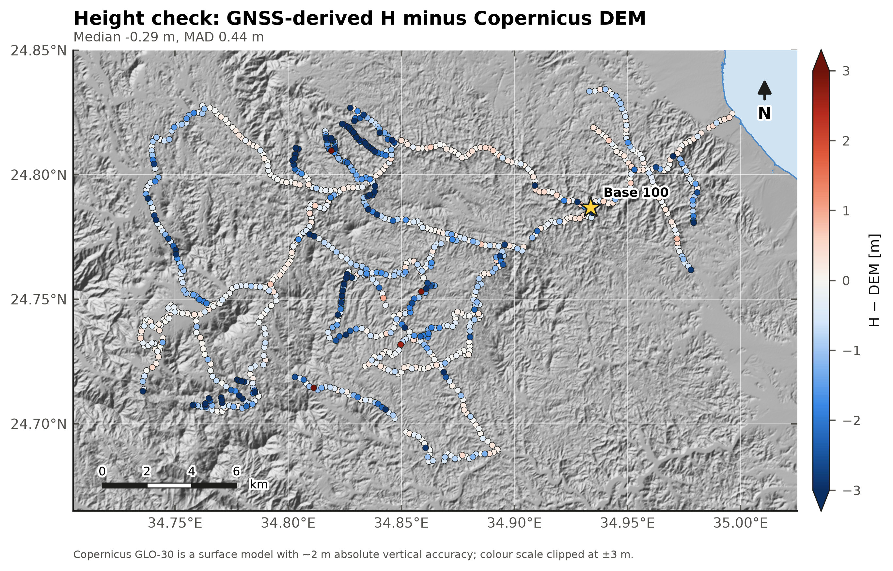
*Map 3 – GNSS-derived orthometric height minus Copernicus GLO-30 at each station; scale clipped at ±3 m.*


*Fig. 9 – Daily height of the two base marks relative to their multi-day median (left); separation between the CG-6 GPS position and the matched GNSS point (right).*

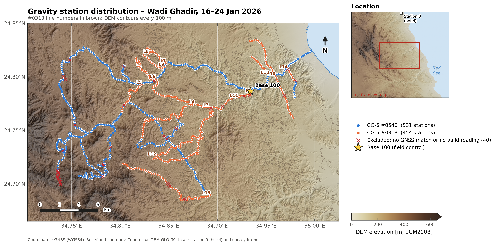
*Map 1 – Gravity stations by instrument on Copernicus GLO-30 relief (100 m contours); ✕ marks excluded occupations. The inset shows station 0 (hotel), ~31 km NNW of base 100.*

### 3.4 Base control and drift model (`10`–`13_*.csv`, Figs. 6–7)

**Control values.** The drift model is built separately for each instrument and day:

* A valid station-100 occupation (Line 0, ≥ 1 accepted reading, within 50 m of the mark) gives g₁₀₀ directly.
* A valid station-0 occupation becomes a supplementary control value, g₁₀₀ = g₀ + T. Here T is the instrument's median 0→100 tie, and its standard deviation is added to the uncertainty. This value affects field data only where a station-100 control is missing:
  * 20 Jan, #0313, Line 9: interpolated between the hotel at 04:16 and base 100 at 11:39 (25 occupations).

**Drift model.** Field occupations are referenced to

  Δg₁₀₀ = g_occ − g₁₀₀(t)

where g₁₀₀(t) is a piecewise-linear interpolation between successive control values of the same day. Outside the controlled interval the value is extrapolated with the rate of the nearest segment. Its uncertainty is

  σ² = σ_occ² + interpolated σ_ctrl² + σ_model² (+ (σ_rate Δt)² when extrapolated)

σ_model is the rms leave-one-out misclosure of interior base-100 occupations:

* #0640: **7.8 µGal** (8 interior occupations).
* #0313: **53 µGal** (7 interior occupations; the 0.47 mGal tare misclosure is excluded and reported separately).

**Daily performance** (Fig. 6, `13_daily_closures.csv`).

| | #0640 | #0313 |
|---|---|---|
| Hotel 0→0 daily closure | −12 to +8 µGal | −405 to +458 µGal |
| Base-100 range within a day | 1–28 µGal | 52–558 µGal |
| Change in the first base-100 value per day (17–24 Jan) | −0.003 mGal/day | −0.40 mGal/day (on top of the on-board 0.3975 mGal/day) |
| Tares | none | +0.558 mGal between 06:11 and 06:55 UTC on 16 Jan, while at base 100 |

The 16 Jan tare falls between two base-100 occupations with no field station between them, so the drift model absorbs it.

**Problems with the #0313 base control.**

* **18 Jan:** the closing base-100 and station-0 readings are frozen. Line 5 stations 1–22 were first extrapolated by 1.5–6.3 h.
* **19 Jan:** the morning station-0 reading is frozen.
* **20 Jan:** the morning base-100 reading is frozen.
* **24 Jan:** one base-100 occupation is frozen.

The 18 Jan Line 5 segment was re-tied to #0640 using 5 co-located points (§3.5).


*Fig. 6 – Base-100 control values per day, relative to the first of the day (µGal; note the 10–20× larger scale for #0313). Squares are station-0 occupations converted with the median tie; ✕ marks frozen occupations.*

### 3.5 Inter-instrument reconciliation (`11_*.csv`, `14_*.csv`, Figs. 7–8)

The two meters are compared only through physical co-location. Station numbers are never used for this.

**(a) Hotel 0 → base 100 tie.** Each day has a morning and an evening leg, raw, ≤ 4 h:

* #0640: −66.0742 ± 0.0077 mGal (sd, n = 18).
* #0313: −65.3101 ± 0.0868 mGal (sd, n = 15).

The ratio is **k_tie = 1.01170 ± 0.00035**. The difference (0.76 mGal over a 66 mGal tie) is far larger than either meter's repeatability and is the same in the morning and evening legs. Drift therefore cannot explain it; it is a scale (calibration) difference.

**(b) Co-located field stations.** These are pairs ≤ 10 m apart with |Δh| ≤ 0.5 m and interpolated drift on both meters. Three pairs, spanning 42 mGal, give **k = 1.0136 ± 0.0010** (through the origin, SE propagated from the station sigmas). This agrees with k_tie at 1.7σ.

**Applied scale.** The weighted combination **k = 1.01189 ± 0.00033** multiplies all #0313 Δg₁₀₀ values (`dg100_scaled_mgal`); the unscaled values are kept. #0640 is the reference because its repeatability is about ten times better. Which meter is correct in an absolute sense **cannot be decided** without a calibration line or absolute stations: if #0640 is itself off, every value inherits that error.

**Re-tie of the extrapolated segment.** Five co-located #0640/#0313 pairs on 18 Jan (Line 5 vs #0640 stations 153–158) show that the extrapolated #0313 values are offset by **−0.225 ± 0.022 mGal**. I applied this offset to the 21 extrapolated #0313 occupations of that day and flagged them `RETIED_COLOCATION`. One #0313 occupation (19 Jan, 2.0 h) is still extrapolated and flagged.


*Fig. 7 – Hotel 0 to base 100 ties (left) and the daily station-0 closure (right) for both meters.*


*Fig. 8 – Co-located stations: #0640 against #0313 Δg₁₀₀ (left) and the residual after k_tie (right). Diamonds are the 18 Jan Line 5 points before the re-tie.*

---

## 4  Reductions, terrain correction and density

### 4.1 Base-relative reductions (`16_field_stations_relative.csv`)

All terms refer to base 100: φ₁₀₀ = 24.786749 °N, h₁₀₀ = 111.77 m (ellipsoidal), N₁₀₀ = 11.88 m, so **H₁₀₀ = 99.89 m**. The DEM gives 100.46 m at that point. Heights are EGM2008 orthometric heights, H = h − N.

| Quantity | Equation | Sign convention |
|---|---|---|
| Observed difference | Δg₁₀₀ (scaled for #0313) | measured |
| Normal gravity | γ(φ) − γ(φ₁₀₀), Somigliana closed form, WGS84 | subtracted |
| Free-air | FA(H) − FA(H₁₀₀), FA(H) = (0.3087691 − 0.0004398 sin²φ) H − 7.2125×10⁻⁸ H² | added |
| Bouguer slab | 0.04193 ρ (H − H₁₀₀) mGal, ρ in g/cm³, H in m | subtracted |
| Topography (complete Bouguer) | ρ · [g₁(station) − g₁(base 100)], g₁ = DEM prism attraction for 1 g/cm³ (§4.2) | subtracted |

The three anomaly products are

  ΔFA = Δg₁₀₀ − [γ(φ) − γ(φ₁₀₀)] + [FA(H) − FA(H₁₀₀)]

  ΔSB(ρ) = ΔFA − 0.04193 ρ (H − H₁₀₀)

  ΔCB(ρ) = ΔFA − ρ [g₁(station) − g₁(base 100)]

ΔSB and ΔCB are tabulated for ρ = 2.00, 2.20, 2.30, 2.40, 2.50, 2.60, 2.67, 2.70, 2.80, 2.90 and 3.00 g/cm³. Adding the (unknown) absolute anomaly of base 100 converts them to absolute anomalies.

**Ranges for the 985 product stations**

| Quantity | Range | Median |
|---|---|---|
| H | 2.2–489.5 m | 281.6 m |
| ΔH | −98 to +390 m | |
| Δg₁₀₀ | −94.4 to +18.3 mGal | |
| ΔFA | −14.8 to +36.8 mGal | 24.9 mGal |
| ΔSB(2.67) | −14.6 to +9.9 mGal | |
| ΔCB(2.67) | −14.0 to +9.4 mGal | 2.3 mGal |

**Uncertainty.** σ_H = 0.15 m nominal, with 0.32 m added in quadrature on day 7.

| Median 1σ | #0640 | #0313 |
|---|---:|---:|
| ΔFA | 0.047 mGal | 0.071 mGal |
| ΔSB(2.67) | 0.031 mGal | 0.061 mGal |

**Density sensitivity.** ΔSB changes by 0.04193·Δρ·ΔH: at ΔH = 390 m, a 0.1 g/cm³ change moves it by 1.6 mGal.

### 4.2 Terrain correction (`wghadir/terrain.py`, `22_terrain_validation.csv`)

**DEM.** Copernicus DEM GLO-30, 1″ (≈ 30 m), EGM2008 heights, covering 34.48–35.26 °E and 24.45–25.07 °N. That is at least 22 km beyond every station; every station passes this coverage test.

* The tile N25 E035 does not exist (open sea), so 3.8 % of the window is set to 0 m.
* Licence: Copernicus DEM © DLR e.V. 2010–2014 and © Airbus Defence and Space GmbH 2014–2018, provided under COPERNICUS by the European Union and ESA.

**Method.** For each station the DEM is converted into right-rectangular prisms with Fatiando a Terra Harmonica (`prism_gravity`, g_z), in a local Cartesian frame centred on the station:

* **Inner zone:** 1″ cells within ±8 coarse cells (≈ ±2 km).
* **Outer zone:** 8 × 8 block-averaged cells (≈ 240 m) out to 22 km (Hayford zone O).
* **Prism extent:** from the geoid to the DEM surface. Both are lowered by d²/2R, so Earth curvature (the Bullard B effect) is included.
* **Station cell:** DEM cells within 50 m of the station are set to the station height, so the station never sits inside a prism. The sensor is assumed 0.2 m above the GNSS point.
* **Sea:** cells at ≤ 0 m carry no mass. Red Sea water and bathymetry are not modelled.

g₁ is the attraction of this topography for 1 g/cm³. Because g₁ is linear in density, one computation serves the whole density sweep. The classical terrain correction (including curvature) is TC = ρ (0.04193 H − g₁).

**Validation.**

* A flat 300 m DEM reproduces the infinite slab to 0.1 % (`scripts/terrain_correction.py --selftest`).
* On 12 stations spanning the whole TC range, g₁ changes by:
  * ≤ 0.002 mGal per g/cm³ when the outer cells are halved to 120 m and the inner zone doubled to ±4 km;
  * up to 0.020 mGal per g/cm³ (0.054 mGal at 2.67) when the outer radius is cut from 22 to 20 km;
  * 0.021–0.031 mGal per g/cm³ (≤ 0.08 mGal at 2.67) when the station is raised by 0.5 m.

**Result.** At 2.67 g/cm³, TC ranges from 0.21 to 2.78 mGal (median 0.88 mGal). It is largest in the incised wadis of the south-west and along the steep valley west of base 100 (Map 8). Base 100 itself has g₁ = 3.77 mGal per g/cm³.

**Remaining limitations.**

* No bathymetry: the 74 stations within 5 km of the coast may be biased by up to a few tenths of a mGal, smoothly varying.
* The DEM is a surface model (DSM).
* Topography beyond 22 km is omitted; its effect is smooth across a 30 km survey and largely cancels in base-relative values.

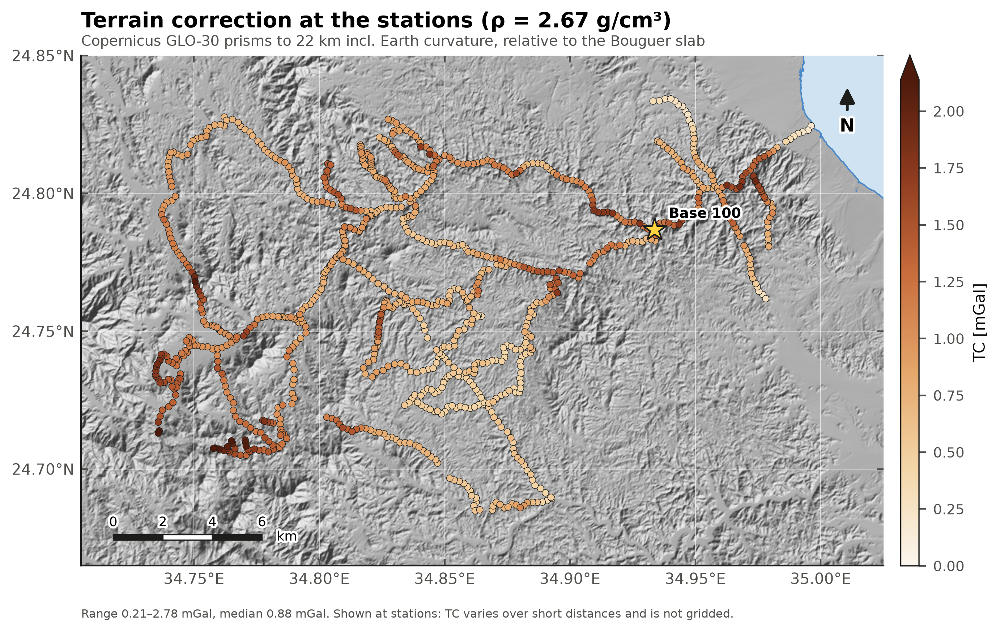
*Map 8 – Terrain correction (ρ = 2.67 g/cm³) at the stations.*

### 4.3 Nettleton density test (`17`–`19_*.csv`, `23_density_consensus.csv`, `outputs/nettleton/`)

**Profiles.** The same 22 traverses as before are used (≥ 15 stations, ≥ 40 m relief, 2.7–30.4 km long). For each trial density ρ = 1.80–3.20 g/cm³:

* B(ρ) = ΔFA − ρ·u is formed, where u is the Bouguer effect for 1 g/cm³ relative to base 100:
  * u = 0.04193 ΔH for the simple Bouguer;
  * u = g₁(station) − g₁(base 100) for the complete Bouguer.
* A linear trend in chainage is removed from B and from H, and their correlation is computed.
* ρ is also estimated by regression, ΔFA = a + b·x + ρ·u, with a 2 000-sample moving-block bootstrap.

Every profile has its own figure (`outputs/nettleton/nettleton_<profile>.png`) showing the topography, ΔCB for ρ = 2.0–3.0 in steps of 0.1, and both correlation curves.

**Results**

| Profile | Simple Bouguer ρ [g/cm³] | Complete Bouguer ρ [g/cm³] |
|---|---|---|
| O-L3 (#0313, 7.7 km, 108 m relief) | 2.93 ± 0.07 | **2.71 ± 0.05** |
| O-L9 (#0313, 2.9 km, 102 m) | 3.15 ± 0.13 | **2.77 ± 0.06** |
| N-L1-433-501 (#0640, 17.1 km, 162 m) | 2.87 ± 0.09 | **2.91 ± 0.08** |
| N-L1-301-335 (#0640, 5.2 km, 78 m) | 3.01 ± 0.28 | **2.96 ± 0.29** |
| O-L7 (#0313, 2.8 km, 69 m) | 5.85 ± 1.41 | **2.95 ± 0.26** |
| O-L6 (#0313, 4.8 km, 72 m) | 3.21 ± 0.22 | 3.30 ± 0.19 |
| N-L1-358-418 (#0640, 11.9 km, 143 m) | 1.63 ± 0.11 | 1.70 ± 0.13 |
| N-L1-149-225 / N-L1-246-300 | −1.14 / −2.04 | −1.20 / −2.55 (non-physical) |

* **3 km windows** (SE < 1 g/cm³):

  | | n | median | IQR | weighted mean |
  |---|---:|---:|---|---|
  | Simple Bouguer | 16 | 3.15 | 2.10–3.43 | 3.05 ± 0.15 |
  | Complete Bouguer | 32 | **2.53** | 1.57–3.02 | **2.79 ± 0.11** (SE scaled by the Birge ratio 2.4) |

* **χ² consistency:** the windows give χ²/dof = 179.9/31 and the profiles 964/18 (complete Bouguer).

**Interpretation**

1. **The terrain correction matters.** With it, the most robust profiles (smallest SE, largest relief) all fall in **2.71–2.96 g/cm³**, and the window median drops from 3.15 to 2.53 g/cm³. This confirms that the earlier high values came from the missing terrain correction.
2. **The estimates remain mutually inconsistent.** Several long #0640 traverses still give non-physical or very low values. Along them the anomaly correlates with topography for geological or regional reasons a linear trend does not remove: N-L1-149-225 climbs 240 m steadily towards the basement massif in the south-west, where ΔCB falls by 15 mGal.
3. **Working density.** The robust-profile range 2.71–2.96 g/cm³ and the complete-Bouguer window mean 2.79 ± 0.11 g/cm³ bracket the standard value. **ρ = 2.67 g/cm³ is retained as the working reduction density, with 2.8 g/cm³ as a sensitivity alternative.** Both are tabulated. This is a reduction density, not a measured rock density; outcrop samples of the main lithologies are needed for that.

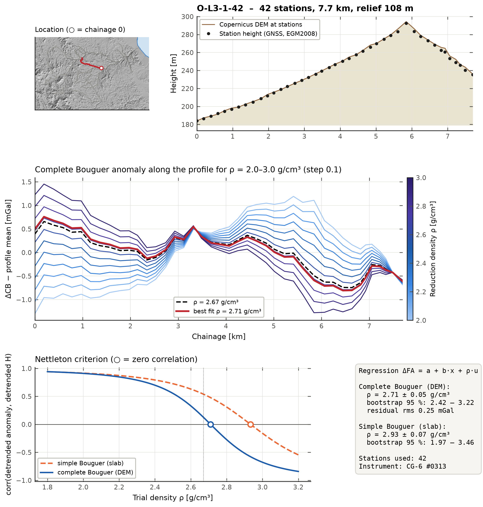
*Nettleton sheet for profile O-L3 (example; one sheet per profile in `outputs/nettleton/`).*

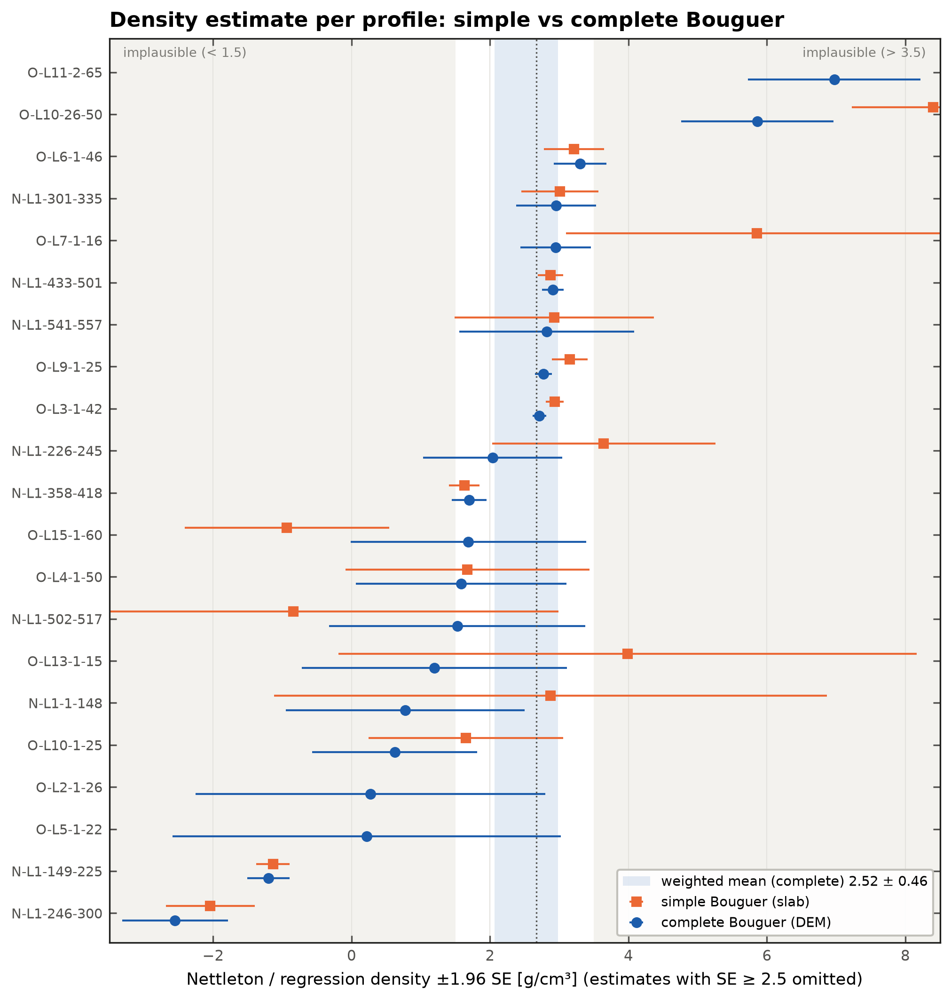
*Density per profile, simple versus complete Bouguer, ±1.96 SE.*

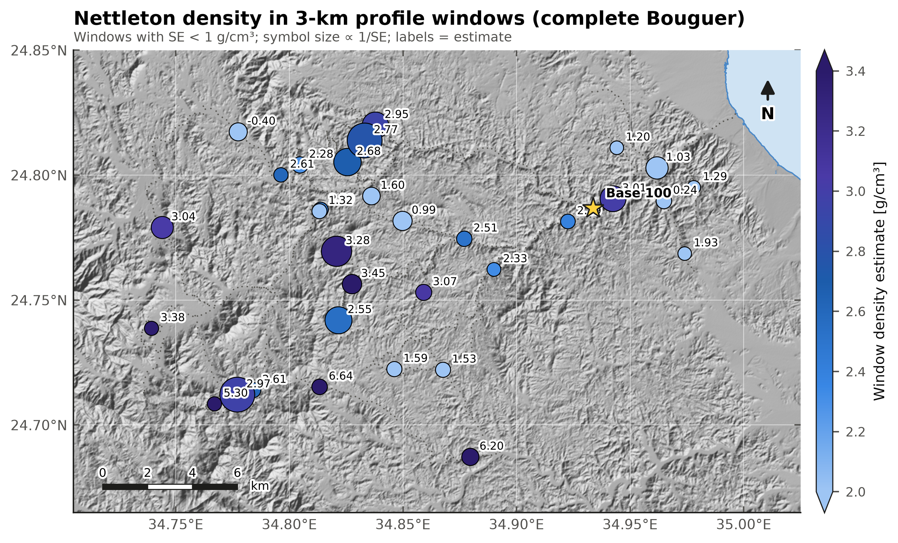
*3 km window densities (complete Bouguer) in map view.*

### 4.4 Maps (`outputs/maps/`, grids in `outputs/grids/`)

All maps use:

* WGS84 coordinates, a Copernicus GLO-30 hillshade and the Red Sea coastline;
* a scale bar and north arrow;
* labelled contours and an explicit colour scale.

**Gridding.** Stations are projected to UTM 36N, reduced to 200 m block medians, and interpolated with a damped biharmonic spline (Verde) on a 100 m grid. Nodes more than 2 km from a station are blanked.

Block K-fold cross-validation (2 km blocks) gives the interpolation error between traverses:

| Grid | rms error [mGal] |
|---|---:|
| Δg₁₀₀ | 1.83 |
| ΔFA | 1.16 |
| ΔSB(2.67) | 0.65 |
| ΔCB(2.67) | 0.64 |

These errors apply between the traverses, not at the stations. Read the grids as a guide to the regional pattern, and use the station values for quantitative work.

| Map | Content |
|---|---|
| map01 | Station distribution, instruments, #0313 line labels, excluded points, location inset |
| map02 | Station orthometric height |
| map03 | GNSS-derived H minus DEM (height QC) |
| map04 | Station 1σ uncertainty of ΔFA |
| map05 | Observed gravity relative to base 100 |
| map06 | Free-air anomaly |
| map07 | Simple Bouguer anomaly, 2.67 g/cm³ |
| map08 | Terrain correction, 2.67 g/cm³ (at the stations) |
| map09 | **Complete Bouguer anomaly, 2.67 g/cm³ (main product)** |
| map10 / map11 | Complete / simple Bouguer anomaly for 2.20, 2.40, 2.67 and 2.90 g/cm³ (common colour scale) |

**What the complete Bouguer map shows.** A NW–SE belt of relative highs (+5 to +9 mGal) runs through the centre of the survey (34.82–34.90 °E). Lows of −10 to −14 mGal lie over the south-western massif, and a −5 to −7 mGal low lies near the coast in the north-east. The pattern is stable across 2.2–2.9 g/cm³; only the amplitude of the topography-correlated part changes. This is a description, not a geological interpretation.

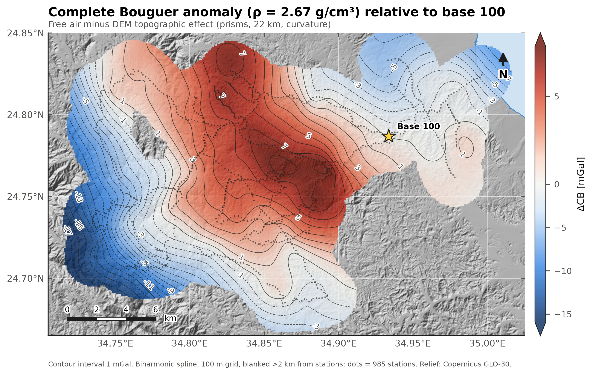
*Map 9 – Complete Bouguer anomaly, ρ = 2.67 g/cm³, relative to base 100.*

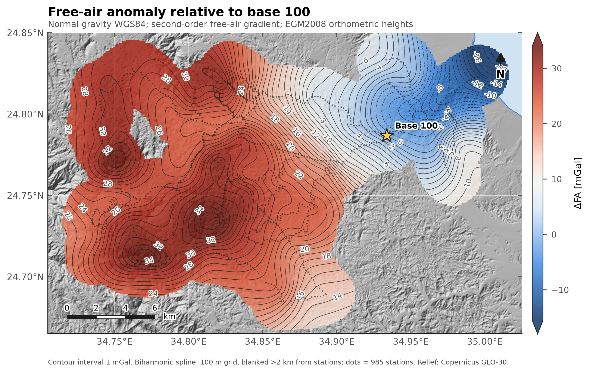
*Map 6 – Free-air anomaly relative to base 100.*

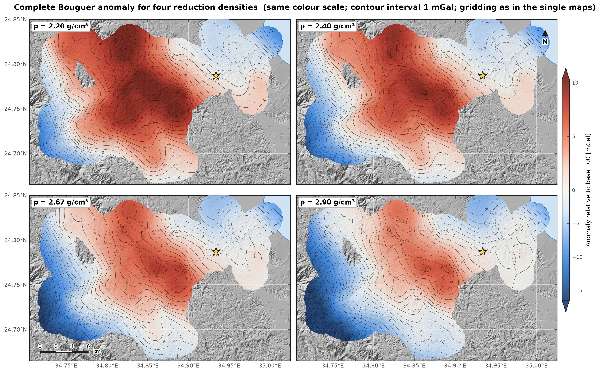
*Map 10 – Complete Bouguer anomaly for four reduction densities.*

---

## 5  Ground magnetic data (`scripts/run_magnetics.py`, `outputs/magnetics/`)

### 5.1 Data and processing

**Source.** `All_Data_Corrected_Total_Intensity.xlsx` holds 12 163 rows with these columns:

* lat, long, UTM 36N x/y, elevation E;
* raw reading;
* time (hhmmss);
* "Corrected data (Total Intensity)", the diurnally corrected total field as supplied.

The diurnal correction applied by the field team (corrected minus raw) ranges from 0 to −170 nT. I did not modify it.

**Survey pattern.** Readings are taken every 2 s, about 2.6 m apart (continuous walking mode), along largely the same traverses as the gravity survey. The file carries no dates. The time stamps split the data into **10 survey days**, a new day starting wherever the time steps back by more than 30 min (`31_mag_day_summary.csv`).

| Step | Rule | Result |
|---|---|---|
| Non-data rows | rows with no time or position (`/line 00000`) | 2 removed |
| Coordinates | UTM 36N recomputed from lat/long and compared with the file's x/y | agreement ≤ 1 cm; 48 rows without x/y filled from lat/long |
| Despike | Hampel filter within each day: window 11 readings (~28 m), reject if deviation > max(30 nT, 6 × 1.4826 × MAD) | 155 readings rejected (1.3 %); **12 006 accepted** |
| Crossover check | accepted readings < 5 m apart on different days | only 3 pairs (days 1/10), median difference −4.9 nT. The days barely overlap, so day-to-day levelling cannot be tested further |
| Main field | IGRF-14 (ppigrf) at each reading, **20 Jan 2026 assumed** (no dates in the file) | F ≈ 41 972 nT, I = 36.74°, D = 4.22° at the survey centre |
| Anomaly | TMA = corrected TMI − IGRF | 1st/50th/99th percentile: −597 / −94 / +1 439 nT |

**Sensitivity to the assumed date.** Between Jan 2025 and Jul 2026 the IGRF total field changes by +41 nT, about 27 nT per year (`33_mag_igrf_date_sensitivity.csv`). The field direction changes by less than 0.06°. An error in the date therefore shifts the anomaly by a constant and leaves its shape and the RTP unchanged.

### 5.2 Gridding and reduction to the pole

**Gridding.** The gravity gridding scheme is used with a finer grid suited to the magnetic wavelengths:

* UTM 36N coordinates;
* 100 m block median, linear trend and damped biharmonic spline (Verde);
* 50 m grid, blanked more than 2 km from the data.

Block K-fold cross-validation gives an rms of 169 nT. That is large because strong, short-wavelength sources are only sampled along the traverses. The grids show the pattern between traverses, but quantitative work should use the readings.

**RTP.** I computed the reduction to the pole by FFT (Harmonica `reduction_to_pole`) with I = 36.74° and D = 4.22°, assuming induced magnetisation along the present field. Before the FFT, the anomaly grid was tapered (sin²) to its median over 3 km beyond the data mask and padded by 50 % on each side, then cropped and re-masked. At this inclination the RTP operator is stable.

Remanent magnetisation, which is common in basement dykes, is not accounted for. RTP anomalies over remanent bodies may be displaced or distorted.

**Maps** (400 dpi, same style and palette as the gravity maps, histogram-equalised colour classes):

| Map | Content |
|---|---|
| mag01 | Corrected total field at the 12 006 accepted readings (points only), with rejected spikes |
| mag02 | Total-field anomaly (TMI − IGRF) at the readings |
| mag03 | Total field, gridded |
| mag04 | Total-field anomaly, gridded |
| mag05 | **Reduced-to-pole anomaly** |

The strongest feature is a ~2 km wide RTP high in the south-west, peaking at +2 870 nT (34.749 °E, 24.723 °N; 99.5th percentile of the grid +1 610 nT). It is flanked by lows to the north and east. A second belt of RTP highs (+400 to +800 nT) lies at 34.85–34.90 °E, 24.78–24.82 °N. The area around base 100 is a broad low, reaching the grid minimum of −540 nT just west of the base.

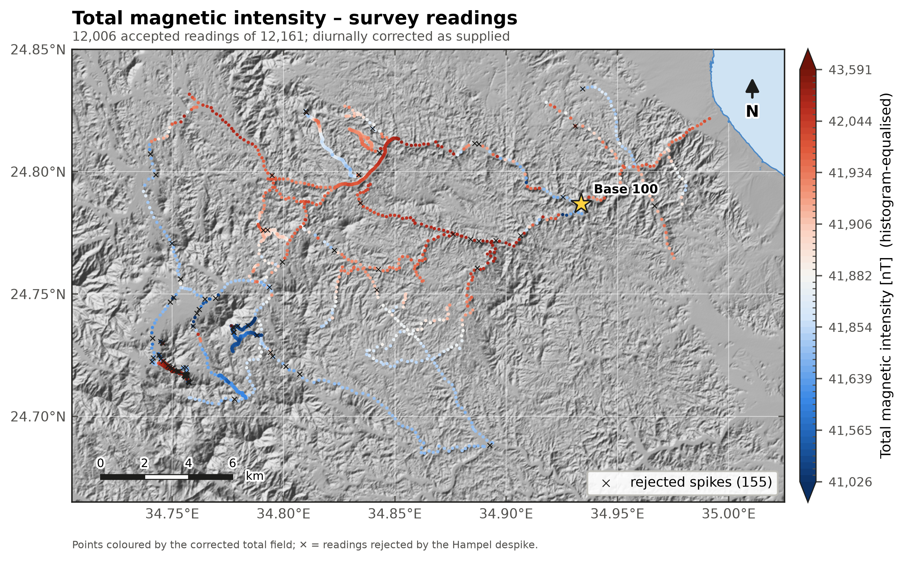
*Mag 1 – Corrected total magnetic intensity at the survey readings.*

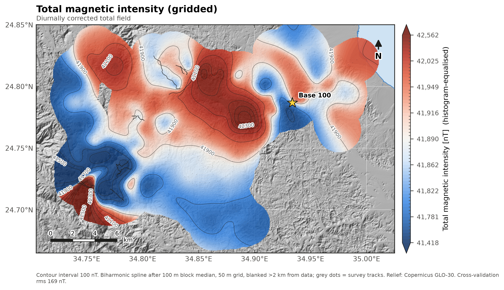
*Mag 3 – Total magnetic intensity, gridded.*

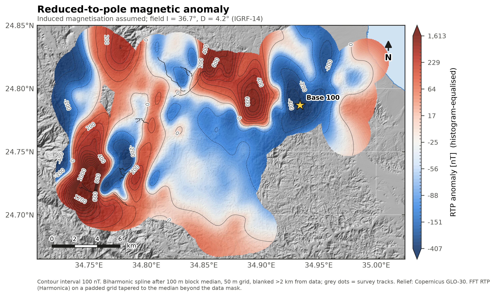
*Mag 5 – Reduced-to-pole anomaly.*

**Outputs.**

* `outputs/deliverables/Wadi_Ghadir_Magnetic_Results.xlsx`: README, all readings with QC flags, IGRF and anomaly, day summary, crossovers, IGRF date sensitivity.
* `outputs/tables/30`–`33_mag_*.csv`.
* Grids `outputs/grids/mag_tmi|tma|rtp.nc` and `_xyz.csv`.

---

## 6  Code, outputs and missing metadata

### 6.1 Code

```bash
python -m pip install -r requirements.txt
python scripts/run_processing.py --raw data/raw --out outputs   # ~3 min (terrain stage ~2 min)
python scripts/run_magnetics.py                                  # magnetics (~1 min, needs the gravity run)
python scripts/build_report_html.py
python scripts/make_package.py --out dist                        # delivery folder + zip
python -m pytest -q tests
```

On the first run the DEM and geoid windows are downloaded into `data/external/`. Later runs use that cache and need no network.

### 6.2 Outputs

| Location | Content |
|---|---|
| `outputs/deliverables/Wadi_Ghadir_Gravity_Results.xlsx` | **Final results workbook**: Final_Stations (985 rows, 57 columns incl. FA, SB and CB for 11 densities, coordinates in WGS84 and UTM 36N), Column_Dictionary, Profiles, Nettleton sheets, base control, ties, instrument scale, height and terrain checks, all occupations and all 1 519 QC rows |
| `outputs/deliverables/*.csv / .geojson / .kml` | Final stations for plotting, GIS and Google Earth |
| `outputs/maps/` | 11 publication maps (400 dpi) |
| `outputs/nettleton/` | 22 profile sheets + 3 summary figures |
| `outputs/figures/` | QC figures (tide, corrections, readings, QC, base 100, ties, instruments, GNSS) |
| `outputs/grids/` | NetCDF and XYZ grids of every gridded map + cross-validation |
| `outputs/tables/` | All processing tables (01–23) and `summary.json` |
| `dist/Wadi_Ghadir_Gravity_Package.zip` | All of the above + report, scripts and input data, as one folder |

### 6.3 Information still needed for final absolute complete Bouguer anomalies

1. **Absolute tie.** An absolute gravity value at base 100 or at the hotel station 0, for example a closed-loop tie to the Egyptian national gravity network. Without it all products remain relative to base 100.
2. **Instrument scale.** A calibration-line run, or the absolute tie made with both meters, to establish which meter's scale is correct. The current result rests on #0640, and the 1.19 % difference for #0313 is derived from the field data alone.
3. **GNSS metadata.**
   * Confirmation of the frame and epoch of the MRSA coordinate. Its ellipsoidal height is inferred here from the DEM comparison.
   * Antenna and pole heights.
   * An explanation of the day-7 offset and the day-1 MRSA coordinate change.
   * Coordinates for the 20 unmatched #0640 stations.
4. **Sensor height.** The CG-6 sensor height above each GNSS-measured point (InstrHeight is 0 in both exports; 0.2 m was assumed for the terrain computation).
5. **#0313 field notes.** Records for the frozen and non-physical periods (§3.4) and for the 16 Jan tare. The tide user position should be corrected in the meter before further use.
6. **Bathymetry.** Red Sea bathymetry (e.g. GEBCO) for the near-coast stations, and, optionally, a higher-resolution bare-earth DEM for the inner zone in narrow wadis.
7. **Rock densities.** Outcrop sample densities of the main lithologies, to replace the working value of 2.67 g/cm³.
8. **Magnetic survey dates and base station.** The actual dates of the 10 magnetic survey days, for the IGRF, and the base-station record behind the diurnal correction.
9. **"Interacts" data.** The third instrument's export file, if that instrument was used.

### References

* Hinze, W. J., et al. (2005). New standards for reducing gravity data: The North American gravity database. *Geophysics*, 70(4), J25–J32.
* Longman, I. M. (1959). Formulas for computing the tidal accelerations due to the moon and the sun. *J. Geophys. Res.*, 64(12), 2351–2355.
* Nettleton, L. L. (1939). Determination of density for reduction of gravimeter observations. *Geophysics*, 4(3), 176–183.
* Copernicus DEM GLO-30, ESA/DLR/Airbus, https://doi.org/10.5270/ESA-c5d3d65.
* Pavlis, N. K., et al. (2012). The development and evaluation of the Earth Gravitational Model 2008 (EGM2008). *J. Geophys. Res.*, 117, B04406.
* Uieda, L., et al. Verde: Processing and gridding spatial data using Green's functions. *J. Open Source Softw.* 3(29), 957 (2018).
* Uieda, L., et al. Harmonica: Forward modelling, inversion, and processing gravity and magnetic data. Fatiando a Terra project, https://www.fatiando.org/harmonica.
